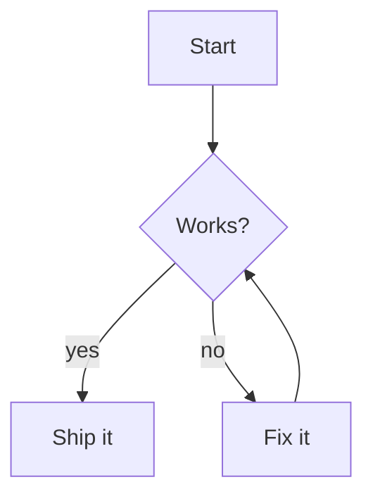

# Editing

What edamame does with your Markdown, and the features built on top of it.

---

## Markdown support

edamame parses CommonMark plus a set of GitHub extensions.

| Element| Markdown Source|
|---|---|
| Headings | `#` through `######`, and the underlined (setext) form |
| Emphasis | `**bold**` · `*italic*` · `` `code` `` · `~~strikethrough~~` |
| Highlight | `==highlighted==` |
| Lists | Bullet and ordered, nested, with loose/tight spacing preserved |
| Task lists | `- [ ]` and `- [x]`, clickable |
| Tables | GitHub pipe tables, drawn as a real grid |
| Code | Fenced and indented, with the language token styled |
| Quotes | `>`, nesting other blocks inside |
| Links | `[text](url)`, `<url>`, `#heading` anchors, local files |
| Images | Local and remote |
| Footnotes | `[^1]` references and definitions, with jump-to navigation |
| Rules | `---`, drawn as a full-width line |
| Line breaks | Two trailing spaces, and soft wraps |
| Diagrams | ` ```mermaid ` fenced blocks |

### Things to know

**HTML comments are hidden.** `<!-- … -->` renders as nothing at all in Preview
and Edit — useful for notes you don't want to see. They're visible and editable
in Raw mode.

**Other HTML is shown, not rendered.** A `<details>` block or a `<sub>` tag
appears as literal text in a muted code style. edamame does not interpret HTML.

**Smart punctuation is on**, and currently not configurable. Straight quotes
render as curly ones, `--` becomes an en dash, `...` becomes an ellipsis. Your
source file is untouched — this is display only.

**Bare URLs are not auto-linked.** `https://example.com` on its own renders as
plain text. Write `<https://example.com>` or `[text](https://example.com)`.

**Code blocks are not syntax highlighted.** The language token gets its own
color; the body is one style. Highlighting is a planned feature.

---

## Formatting text

Select some text, then:

| Key (palette)| Action|
|---|---|
| `Ctrl-B` | Bold |
| `Ctrl-I` | Italic |
| *palette* | Inline code, strikethrough, highlight |

These toggle — run bold on already-bold text and the markers come off. They
need a **non-empty selection on a single line**.

If `Ctrl-B` / `Ctrl-I` do nothing (or insert a tab), your terminal is the
reason — see
[Terminal compatibility](keybindings.md#terminal-compatibility).

**Insert Link** and **Insert Image** (palette) drop a
`[link text](file path or URL)` snippet at the cursor, or wrap your selection
as the visible text. The placeholder is left selected, so you can type straight
over it.

---

## Lists

Press `Enter` at the end of a list item and edamame continues the list — copying the bullet, or incrementing the number. `Enter` on an empty item adds a blank line for loose spacing; another `Enter` ends the list.

**Ordered lists renumber themselves.** Insert an item in the middle and the
numbers below follow. This runs after edits in Edit mode; it's deliberately
switched off in Raw mode, where you own the text exactly as written. Undo and
redo never trigger it, so they stay exact inverses.

If a list's numbering has drifted — usually from pasted text — **Fix list
numbering** in the palette re-sequences the list under the cursor in one
undoable step.

### Task lists

`Ctrl-Space` toggles the checkbox on the current line. You can also **click
the checkbox** directly; a click on the box toggles it without moving your
cursor, while a click anywhere else on the line moves the cursor normally.

Completed items dim and get struck through. This is configurable in the theme.

---

## Tables

Tables render as a drawn grid, and edit a cell at a time. In Edit mode the
cell you're in shows its raw text in place; everything else stays formatted.

### Creating one

`Ctrl-Shift-T`, or "Insert table" in the palette. You'll be asked for rows and
columns. **The cursor has to be on a blank line** — otherwise you get an error
flash instead of a table.

### Moving around

| Key| Action|
|---|---|
| `Tab` / `Shift-Tab` | Next / previous cell |
| `Enter` | Next row |
| `Shift-Enter` | Insert a literal `<br>` |

Outside a table these keys do their normal thing, so nothing is taken away
from you.

> `Shift-Enter` inserts `<br>`, which is how GitHub-flavored Markdown writes a multi-line cell. Be aware that edamame's own renderer currently shows it as literal `<br>` text rather than breaking the line, and HTML export strips it. It's written for other tools' benefit, not yet for edamame's.

### Changing the shape

The arrow points the direction; `Shift` turns "move" into "insert".

| Key| Action|
|---|---|
| `Alt-↑` `Alt-↓` | Move row |
| `Alt-←` `Alt-→` | Move column |
| `Alt-Shift-↑` `Alt-Shift-↓` | Insert row above / below |
| `Alt-Shift-←` `Alt-Shift-→` | Insert column left / right |
| `Alt-Backspace` | Delete row |
| `Alt-Shift-Backspace` | Delete column |

All ten are in the palette as `Table: …` — worth knowing, because the
`Alt-Shift` chords need a modern terminal.

### With a mouse

When your terminal supports a mouse, the table your cursor is in grows
handles:

- **`⠿`** at the left of a row, or on top of a column — drag to reorder
- **`⇔`** on the header row's dividers — drag to resize a column
- **`✕`** on the outer border — delete that row or column


Handles belong to the table your cursor is in — that's the table they're
drawn on, and the only one they act on. Clicking a handle on another table
moves your cursor there first, which is the same click that makes its
handles appear; click again to use them.

Within that table the reorder handles are forgiving to grab: anywhere in
the left gutter beside the rows starts a row drag, and anywhere along the
top border starts a column drag. While you drag, every place the row or
column could land is outlined, with the one under your pointer highlighted.
The `✕` buttons are deliberately not forgiving — they're the destructive
pair, so they only respond on the glyph itself, and a second click landing
within a moment of the first is ignored, so double-clicking one removes a
single row. Clicking steadily deletes row after row.

Turn them off with "Toggle table buttons" in the palette, or the settings
overlay.

**Resizing a column writes a comment into your document** —
`<!-- tui-columns: [80, _, 20] -->` on the line after the table — because
that's the only place a width can persist. edamame asks before doing this the
first time. The comment is invisible in Preview and Edit, and other Markdown
tools ignore it. edamame uses a smart algorithm to calculate column widths by default, so this is usually not necessary.

### Repairing a table

Switch to Raw mode (``Ctrl-` ``). All the pipes and dashes become ordinary
editable text and every guardrail is off.

---

## Footnotes

Write `[^1]` where you want a reference and `[^1]: the note` wherever the
definition should live. References render as bracketed markers — `[^1]`
becomes `[1]` — and references written back to back are joined into one
marker, so `[^1][^2][^3]` renders as `[1,2,3]`.

`Ctrl-Enter` on a reference jumps to its definition; on a definition, it jumps
back to the reference you came from. `Alt-←` also walks back.

Three palette commands help with upkeep:

- **Insert footnote** — adds an auto-numbered `[^N]` reference, picking the
  next free number
- **Delete footnote** — removes the footnote at the cursor: every reference
  *and* the definition, then renumbers
- **Renumber footnotes** — re-sequences numeric footnotes into the order they
  first appear. Named labels like `[^note]` are left alone.

---

## Links

`Ctrl-Enter` follows the link under the cursor. With a mouse: click in
Preview, `Ctrl`-click in Edit or Raw. Hovering shows the target on the hint
line.

What happens depends on the target:

| Target | Result |
|---|---|
| `https://…`, `mailto:…` | Opens in your default application |
| Another `.md` file | Opens in edamame |
| Any other local file | Handed to the OS |
| `#heading` | Jumps within the document |
| `[^note]` | Jumps to the footnote |

`Alt-←` / `Alt-→` move back and forward through everywhere you've been —
across files and within a document. Leaving a modified file prompts first.

> edamame opens links without asking. That's normal for a Markdown viewer, but it means a link in a document you didn't write can hand an arbitrary target to your OS. See [security.md](security.md).

---

## Search and replace

`Ctrl-F` opens a box with **Search** and **Replace** fields. What you get
depends on whether you fill in Replace.


**Leave Replace empty** and you get highlighting you can navigate. Matches are
marked, `Tab` and `Shift-Tab` walk them, `Esc` clears. You can keep editing
normally throughout.

**Fill Replace in** and the flow takes over the keyboard until you're done:

| Key| Action|
|---|---|
| `Tab` / `Shift-Tab` | Next / previous match |
| `r` | Replace this one and move on |
| `a` | Replace all — a single undo step — and exit |
| `Esc` | Leave, staying where you are |

While replacing, editing keys are held back so a stray keystroke can't rewrite
the document out from under the match list. Navigation, copying, scrolling and
saving still work.

**Case sensitivity differs between the two, deliberately.** Navigating is
*smartcase*: a lowercase search matches any case, but as soon as you type a
capital it becomes exact. Replacing is always case-sensitive, so searching
`color` never rewrites a `Color` you didn't mean to touch.

Searches are literal text, not regular expressions. (Vim mode's `:s` does take
regexes; see [vim-mode.md](vim-mode.md).)

**A search can cross a line break**, written as `\n`:

| Type | Matches |
|---|---|
| `\n` | a line break |
| `\t` | a tab |
| `\r` | a carriage return |
| `\\` | a single backslash |

So `  \n` finds every line ending in two spaces, and replacing it with a space
joins those lines. The Replace field takes the same escapes, so you can also
replace *with* a line break.

Because a backslash starts an escape, **a literal backslash must be typed
`\\`** — and anything else after a backslash (`\d`, say) is reported as an
error rather than searched for. Pasting handles this for you: paste text
containing backslashes or line breaks and it arrives correctly escaped.

**Go to section** (`Ctrl-G`) is often what you actually want: a fuzzy list of
every heading, previewing as you arrow through it. `Esc` puts you back.

---

## When the file changes underneath you

If something else writes the file you have open — a `git checkout`, a formatter, an AI agent — edamame will not silently swap it out.

**With no unsaved changes**, it opens **diff review**: your version and the new one, stacked, hunk by hunk, with word-level highlighting inside changed lines. Tables are split per row, so you can take one row and leave another.


| Key| Action|
|---|---|
| `Tab` / `Shift-Tab` | Move between hunks |
| `y` / `n` | Accept / reject this hunk |
| `Y` / `N` | Accept / reject everything (asks first) |
| `Backspace` | Undecide this hunk |
| `Esc` | Finish |

`Esc` only works once every hunk is decided, and then asks before writing. So nothing is applied until you've seen all of it and said yes. Editing and saving are unavailable while a diff is open; the merged result becomes a normal undoable edit afterwards.

**With unsaved changes**, you get a conflict prompt instead, with **Merge** to enter diff review when you're ready.

**If the file was deleted**, edamame tells you and offers to write your buffer back out — it's now the only copy.

If you prefer not to enter diff review when the file is overwritten, set `diff_on_change = false` and a clean buffer reloads silently. A modified buffer always asks so that your changes aren't lost.

---

## Images

Local and remote images render inline, given a terminal that can do it.

edamame asks before rendering the first time (`"ask"` is the default), and asks
separately before fetching anything over the network. Both answers can be
"just this once" or "remember this".

Where images can't be shown you get an `[Image: alt text]` placeholder, so the
document still reads.

Move the cursor into an image and it's replaced by its `` source
line, the way any other block reveals — the rows the picture occupied close up
and the document reflows around the single line you're editing. Move the cursor
out and the image comes back.


**Formats:** PNG, JPEG, GIF, BMP, WebP, and SVG. Anything else is reported as
an unsupported image rather than rendered — the list is kept deliberately
short because edamame decodes images from documents you may not trust.

**Requirements:** an image protocol — Kitty, iTerm2, or Sixel — *and* 24-bit
color. Below truecolor, edamame declines to render images at all, because the
result would be badly quantized. Half-block rendering is available as a
low-fidelity fallback.

Size ceilings are `max_width` / `max_height` in
[configuration](configuration.md#images); images scale to fit and keep their
aspect ratio.

## Diagrams

Fenced ` ```mermaid ` blocks are rendered to images:

````markdown

````

Same terminal requirements as images, and its own consent prompt — you can
enable diagrams without enabling images or vice versa.

Move the cursor into a diagram and the image is replaced by its full mermaid
source, exactly as a fenced code block reveals — however tall or short the
rendered image was, every source line is shown and the rest of the document
reflows around it. Move the cursor out and the image comes back.


Rendering happens in the background and results are cached by content, so
editing one diagram doesn't re-render the others. Mermaid is the only diagram
language supported. A diagram that fails to render reports it on the hint line
and leaves the code block visible.

---

## Exporting to HTML

"Export HTML" in the palette. The output lands beside your document —
`notes/guide.md` exports `notes/guide.html`.

Four choices, remembered for next time:

- **Title** — the document title
- **Inline images** — embed local images in the file as Base64 (self-contained but larger) or leave them as links
- **Inline diagrams** — render mermaid blocks into the file, or leave them as code blocks
- **Stylesheet** — the bundled one, or your own

For your own stylesheet, drop a `.css` file into the `export/` folder in your
config directory and it appears in the picker. A `default.css.example` is
written there to start from.

Exports are written atomically, and you're asked before overwriting an existing
file. When it's done you can open it in a browser or reveal the folder.

Some things are deliberately stripped on the way out, because an exported file
is usually one you share: raw HTML, and links using schemes other than
`http`, `https`, `mailto` and `tel`. Diagrams are rasterized rather than
embedded as SVG. Only images inside the document's own folder are ever inlined.
The reasoning is in [security.md](security.md).

HTML is currently the only export target.

---

## Editing elsewhere

**Open in external editor** (palette) saves your buffer, hands the file to `$VISUAL` or `$EDITOR`, and reloads when you come back. Useful for a big mechanical change you'd rather do in your usual editor, such as a complex substitution that edamame's Vim mode doesn't support.

---

## Other things worth knowing

**Undo** groups sensibly — a typed word is one step, not one per character.
`Ctrl-Z` / `Ctrl-Shift-Z` (or `Ctrl-R`).

**Autosave** is off by default. Turned on, it writes after you stop typing for
a few seconds. Files with no name are never autosaved, since there's nowhere
to put them.

**Selection with a mouse**: drag to select, double-click for a word,
triple-click for a line. Inside a table, dragging stays within the cell.
Scrolling never moves the cursor.

**Line numbers**, a **width cap** for wide terminals, and **big block-letter
H1s** are all available and all off by default — see
[configuration.md](configuration.md). Line numbers count *source* lines in
every mode, so a given line carries the same number in Raw as in Rendered, and
the same one your other editor shows — and the same one `G` and `:{N}` jump to.

What changes between modes is which numbers are *shown*, never which number a
line gets. A rendered view has rows that belong to no source line, and source
lines that occupy no row:

- Rows that exist only because of how a block is drawn — a table's borders, the
  rows an image or a diagram reserves, the continuation rows of a wrapped line
  — are left blank.
- A line with no row of its own is simply not numbered anywhere in Preview or
  Rendered. That covers a hidden block-level HTML comment and a blank line that
  the renderer swallows inside a list item. Switch to Raw to see them.

So the numbers down the gutter may skip, but they never disagree: the number
beside a line of text is always that line's number in the file.
