# Mermaid Diagram Smoke Test

This document exercises every diagram type supported by
`mermaid-rs-renderer`. Open it in `edamame` and scroll through each
block to verify that rendering, caching, and invalidation all behave.

## Core

### Flowchart

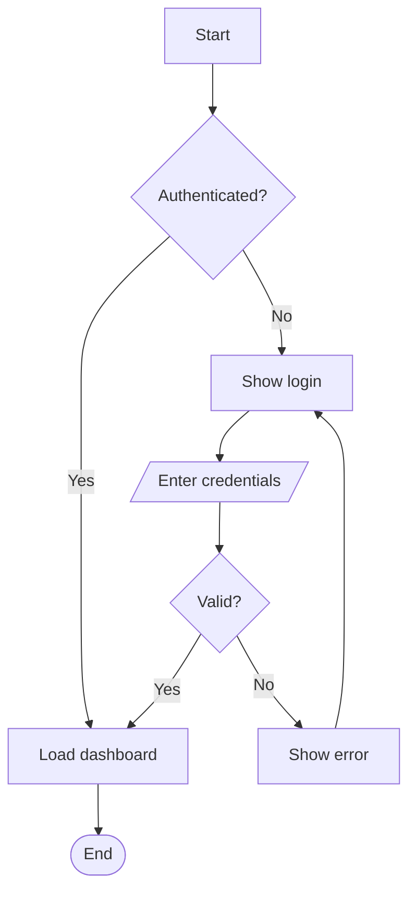
```mermaid
flowchart TD
    A[Start] --> B{Authenticated?}
    B -- Yes --> C[Load dashboard]
    B -- No --> D[Show login]
    D --> E[/Enter credentials/]
    E --> F{Valid?}
    F -- Yes --> C
    F -- No --> G[Show error]
    G --> D
    C --> H([End])
```

### Sequence

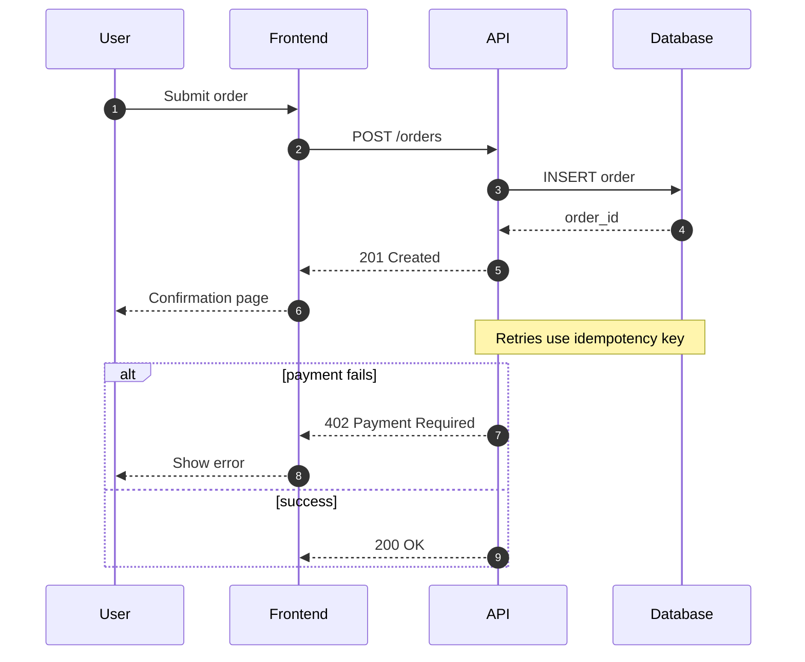
```mermaid
sequenceDiagram
    autonumber
    participant U as User
    participant F as Frontend
    participant A as API
    participant D as Database

    U->>F: Submit order
    F->>A: POST /orders
    A->>D: INSERT order
    D-->>A: order_id
    A-->>F: 201 Created
    F-->>U: Confirmation page

    note over A,D: Retries use idempotency key
    alt payment fails
        A-->>F: 402 Payment Required
        F-->>U: Show error
    else success
        A-->>F: 200 OK
    end
```

### Class

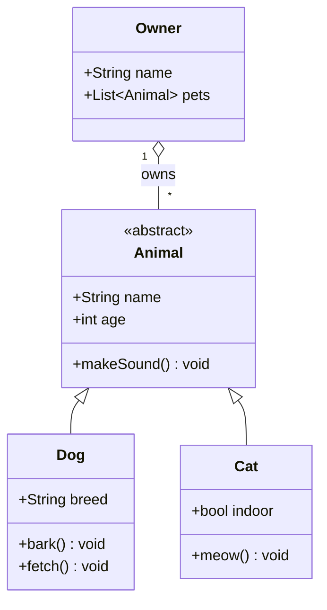
```mermaid
classDiagram
    class Animal {
        <<abstract>>
        +String name
        +int age
        +makeSound() void
    }
    class Dog {
        +String breed
        +bark() void
        +fetch() void
    }
    class Cat {
        +bool indoor
        +meow() void
    }
    class Owner {
        +String name
        +List~Animal~ pets
    }

    Animal <|-- Dog
    Animal <|-- Cat
    Owner "1" o-- "*" Animal : owns
```

### State

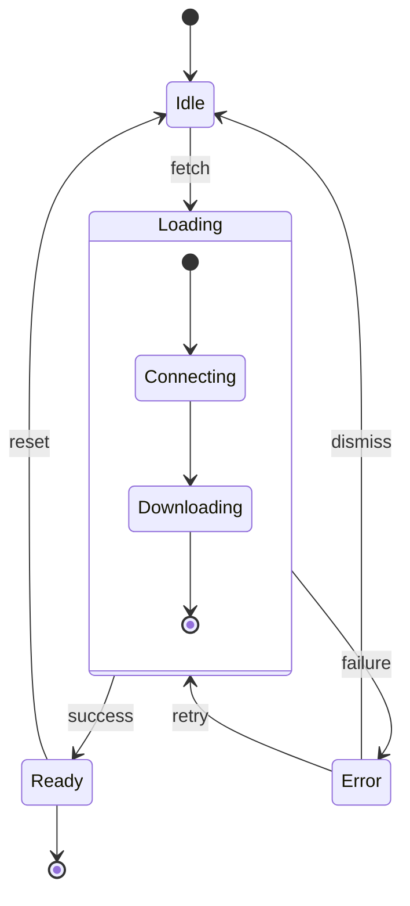
```mermaid
stateDiagram-v2
    [*] --> Idle
    Idle --> Loading : fetch
    Loading --> Ready : success
    Loading --> Error : failure
    Ready --> Idle : reset
    Error --> Loading : retry
    Error --> Idle : dismiss
    Ready --> [*]

    state Loading {
        [*] --> Connecting
        Connecting --> Downloading
        Downloading --> [*]
    }
```

## Data

### ER Diagram

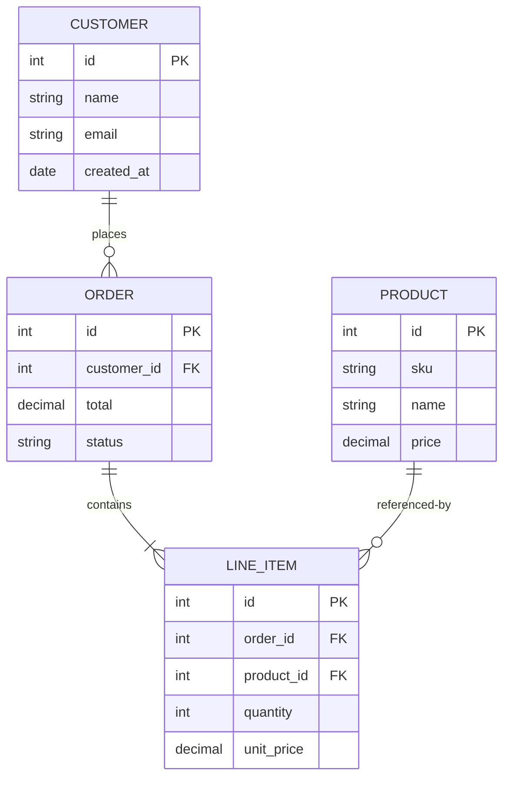
```mermaid
erDiagram
    CUSTOMER ||--o{ ORDER : places
    ORDER ||--|{ LINE_ITEM : contains
    PRODUCT ||--o{ LINE_ITEM : referenced-by
    CUSTOMER {
        int id PK
        string name
        string email
        date created_at
    }
    ORDER {
        int id PK
        int customer_id FK
        decimal total
        string status
    }
    LINE_ITEM {
        int id PK
        int order_id FK
        int product_id FK
        int quantity
        decimal unit_price
    }
    PRODUCT {
        int id PK
        string sku
        string name
        decimal price
    }
```

### Pie Chart

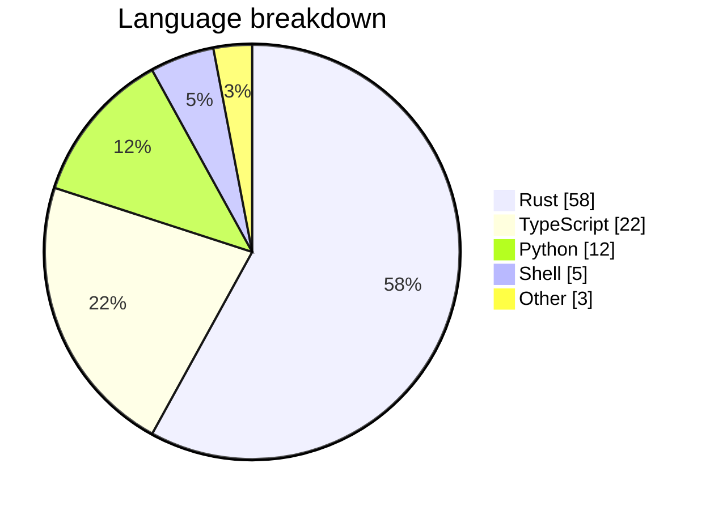
```mermaid
pie showData title Language breakdown
    "Rust"       : 58
    "TypeScript" : 22
    "Python"     : 12
    "Shell"      : 5
    "Other"      : 3
```

### XY Chart

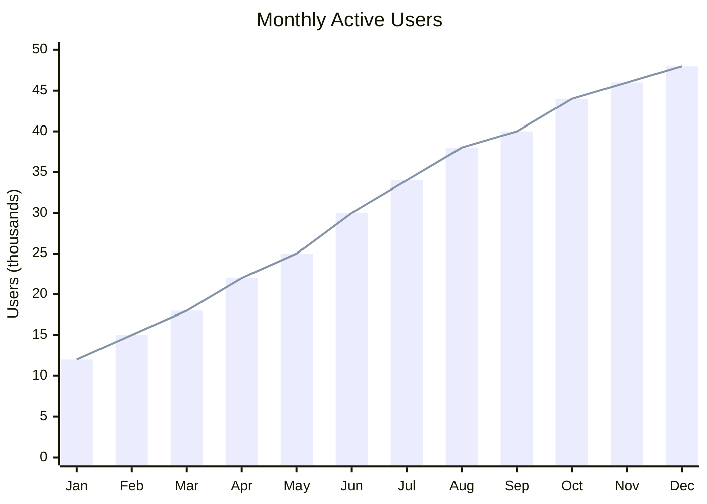
```mermaid
xychart-beta
    title "Monthly Active Users"
    x-axis [Jan, Feb, Mar, Apr, May, Jun, Jul, Aug, Sep, Oct, Nov, Dec]
    y-axis "Users (thousands)" 0 --> 50
    bar  [12, 15, 18, 22, 25, 30, 34, 38, 40, 44, 46, 48]
    line [12, 15, 18, 22, 25, 30, 34, 38, 40, 44, 46, 48]
```

### Quadrant Chart

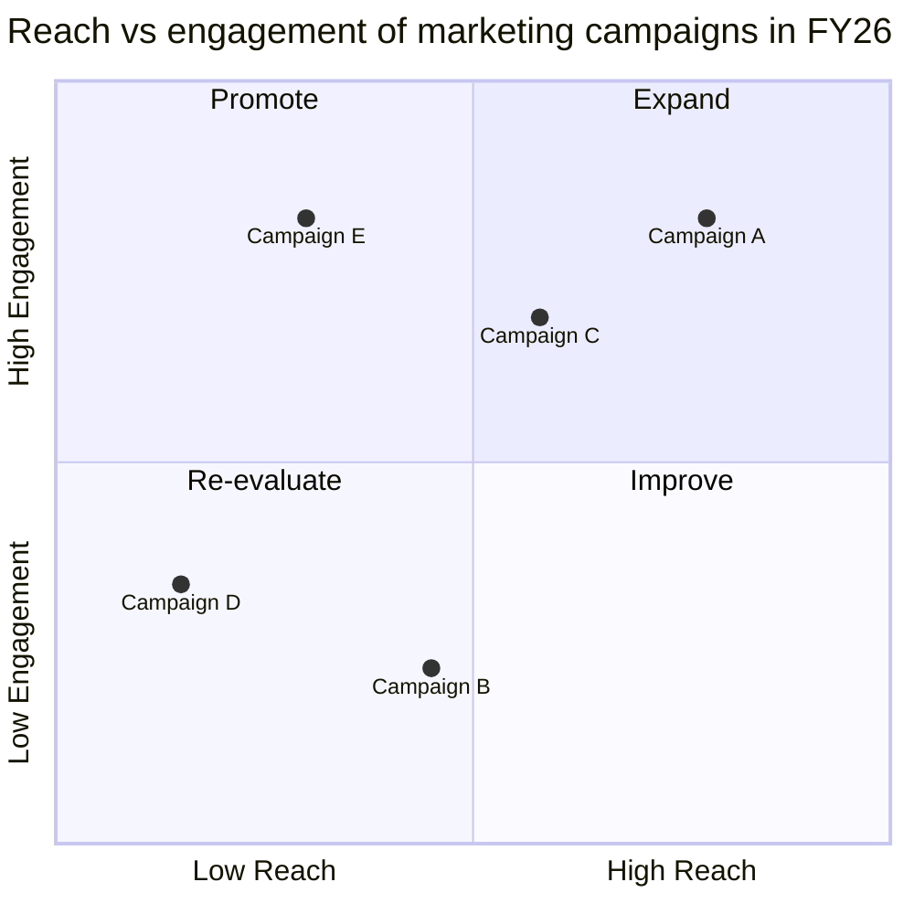
```mermaid
quadrantChart
    title Reach vs engagement of marketing campaigns in FY26
    x-axis Low Reach --> High Reach
    y-axis Low Engagement --> High Engagement
    quadrant-1 Expand
    quadrant-2 Promote
    quadrant-3 Re-evaluate
    quadrant-4 Improve
    Campaign A: [0.78, 0.82]
    Campaign B: [0.45, 0.23]
    Campaign C: [0.58, 0.69]
    Campaign D: [0.15, 0.34]
    Campaign E: [0.30, 0.82]
```

### Sankey

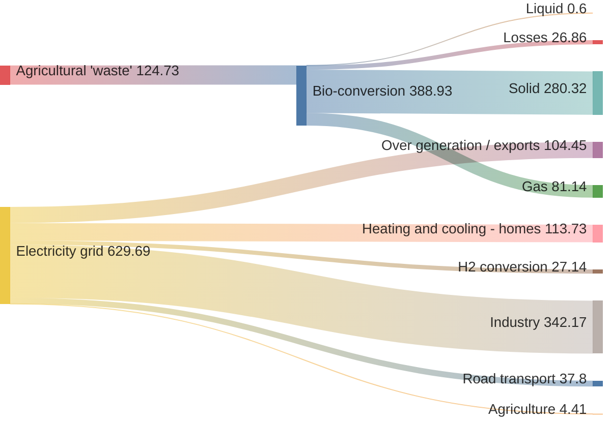
```mermaid
sankey-beta
Bio-conversion,Liquid,0.597
Bio-conversion,Losses,26.862
Bio-conversion,Solid,280.322
Bio-conversion,Gas,81.144
Electricity grid,Over generation / exports,104.453
Electricity grid,Heating and cooling - homes,113.726
Electricity grid,H2 conversion,27.14
Electricity grid,Industry,342.165
Electricity grid,Road transport,37.797
Electricity grid,Agriculture,4.412
Agricultural 'waste',Bio-conversion,124.729
```

## Planning

### Gantt

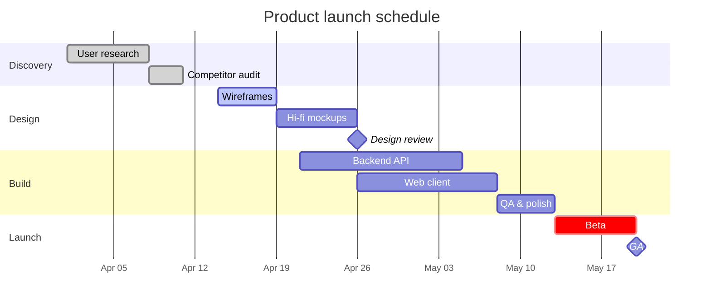
```mermaid
gantt
    title Product launch schedule
    dateFormat YYYY-MM-DD
    axisFormat %b %d

    section Discovery
    User research      :done,    r1, 2026-04-01, 7d
    Competitor audit   :done,    r2, after r1, 3d

    section Design
    Wireframes         :active,  d1, 2026-04-14, 5d
    Hi-fi mockups      :         d2, after d1, 7d
    Design review      :milestone, d3, after d2, 0d

    section Build
    Backend API        :         b1, 2026-04-21, 14d
    Web client         :         b2, after d2, 12d
    QA & polish        :         b3, after b2, 5d

    section Launch
    Beta               :crit,    l1, after b3, 7d
    GA                 :milestone, l2, after l1, 0d
```

### Timeline

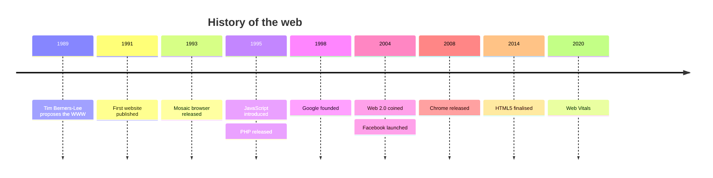
```mermaid
timeline
    title History of the web
    1989 : Tim Berners-Lee proposes the WWW
    1991 : First website published
    1993 : Mosaic browser released
    1995 : JavaScript introduced
         : PHP released
    1998 : Google founded
    2004 : Web 2.0 coined
         : Facebook launched
    2008 : Chrome released
    2014 : HTML5 finalised
    2020 : Web Vitals
```

### Journey

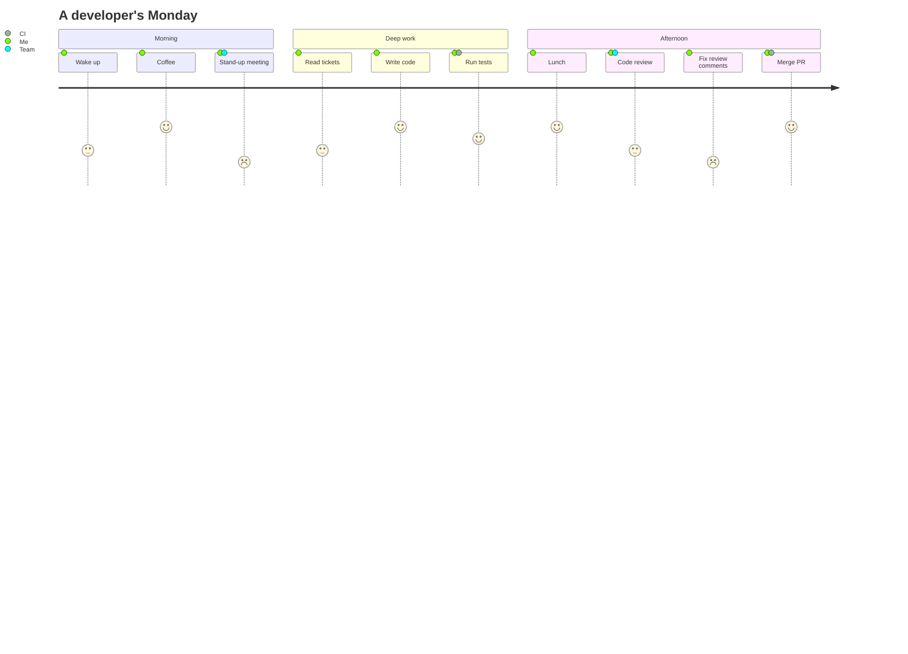
```mermaid
journey
    title A developer's Monday
    section Morning
      Wake up              : 3: Me
      Coffee               : 5: Me
      Stand-up meeting     : 2: Me, Team
    section Deep work
      Read tickets         : 3: Me
      Write code           : 5: Me
      Run tests            : 4: Me, CI
    section Afternoon
      Lunch                : 5: Me
      Code review          : 3: Me, Team
      Fix review comments  : 2: Me
      Merge PR             : 5: Me, CI
```

### Kanban

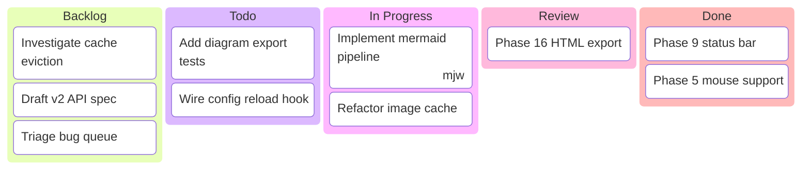
```mermaid
kanban
    Backlog
        [Investigate cache eviction]
        [Draft v2 API spec]
        [Triage bug queue]
    Todo
        [Add diagram export tests]
        [Wire config reload hook]
    In Progress
        [Implement mermaid pipeline]@{ assigned: 'mjw' }
        [Refactor image cache]
    Review
        [Phase 16 HTML export]
    Done
        [Phase 9 status bar]
        [Phase 5 mouse support]
```

## Architecture

### C4

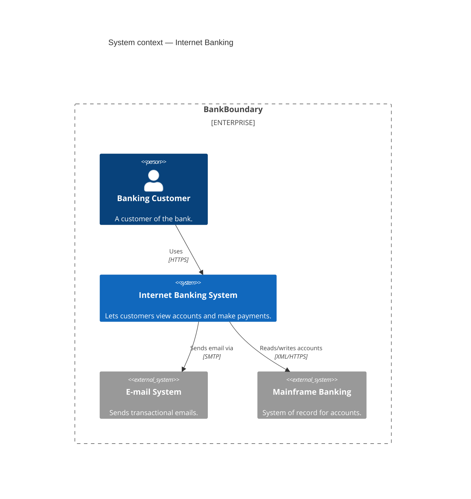
```mermaid
C4Context
    title System context — Internet Banking
    Enterprise_Boundary(b0, "BankBoundary") {
        Person(customer, "Banking Customer", "A customer of the bank.")
        System(banking, "Internet Banking System", "Lets customers view accounts and make payments.")
        System_Ext(mail, "E-mail System", "Sends transactional emails.")
        System_Ext(mainframe, "Mainframe Banking", "System of record for accounts.")
    }
    Rel(customer, banking, "Uses", "HTTPS")
    Rel(banking, mail, "Sends email via", "SMTP")
    Rel(banking, mainframe, "Reads/writes accounts", "XML/HTTPS")
    UpdateRelStyle(customer, banking, $offsetX="-40")
```

### Block

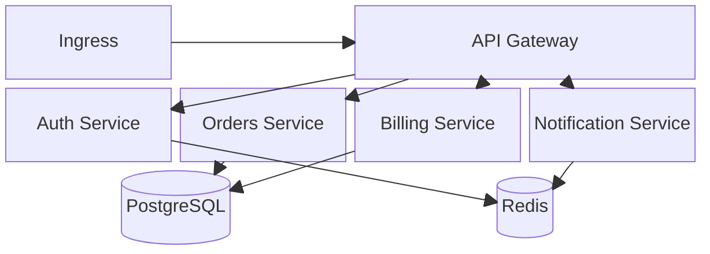
```mermaid
block-beta
    columns 4
    A["Ingress"]:1
    space:1
    B["API Gateway"]:2
    C["Auth Service"]:1
    D["Orders Service"]:1
    E["Billing Service"]:1
    F["Notification Service"]:1
    G[("PostgreSQL")]:2
    H[("Redis")]:2
    A --> B
    B --> C
    B --> D
    B --> E
    B --> F
    D --> G
    E --> G
    C --> H
    F --> H
```

### Architecture

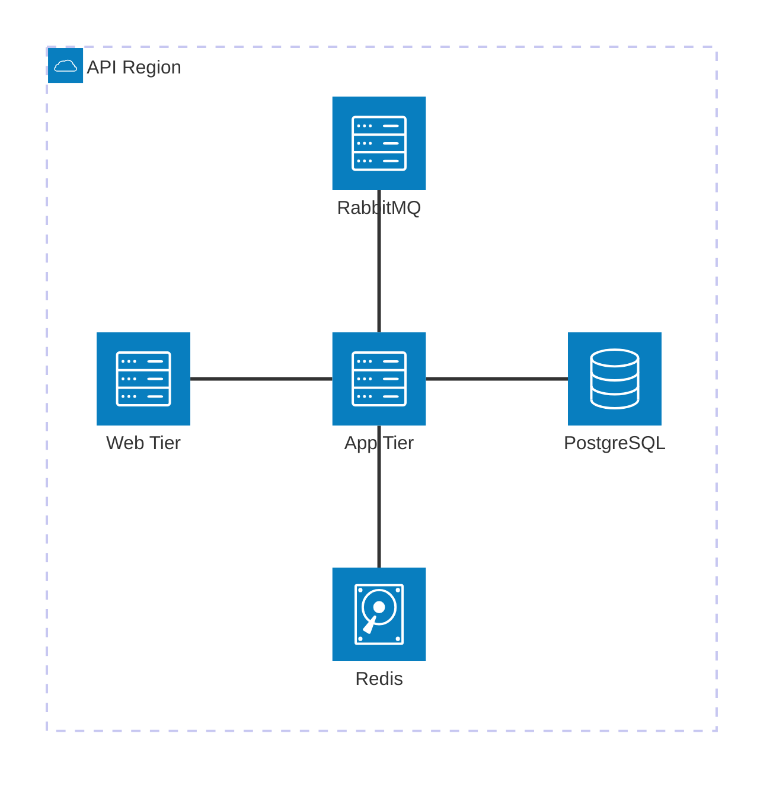
```mermaid
architecture-beta
    group api(cloud)[API Region]

    service web(server)[Web Tier] in api
    service app(server)[App Tier] in api
    service cache(disk)[Redis] in api
    service db(database)[PostgreSQL] in api
    service queue(server)[RabbitMQ] in api

    web:R -- L:app
    app:R -- L:db
    app:B -- T:cache
    app:T -- B:queue
```

### Requirement

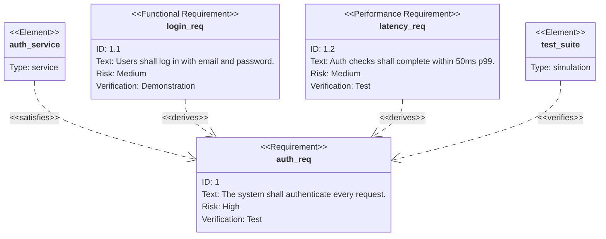
```mermaid
requirementDiagram
    requirement auth_req {
        id: 1
        text: "The system shall authenticate every request."
        risk: high
        verifymethod: test
    }

    functionalRequirement login_req {
        id: 1.1
        text: "Users shall log in with email and password."
        risk: medium
        verifymethod: demonstration
    }

    performanceRequirement latency_req {
        id: 1.2
        text: "Auth checks shall complete within 50ms p99."
        risk: medium
        verifymethod: test
    }

    element auth_service {
        type: service
    }

    element test_suite {
        type: simulation
    }

    auth_service - satisfies -> auth_req
    login_req - derives -> auth_req
    latency_req - derives -> auth_req
    test_suite - verifies -> auth_req
```

## Other

### Mindmap

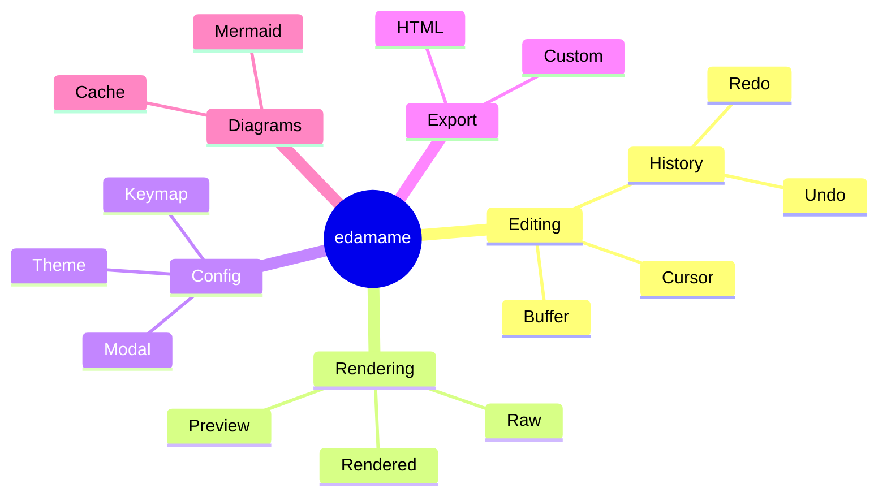
```mermaid
mindmap
    root((edamame))
        Editing
            Buffer
            Cursor
            History
                Undo
                Redo
        Rendering
            Preview
            Rendered
            Raw
        Config
            Theme
            Keymap
            Modal
        Export
            HTML
            Custom
        Diagrams
            Mermaid
            ::icon(fa fa-cloud)
            Cache
```

### Git Graph

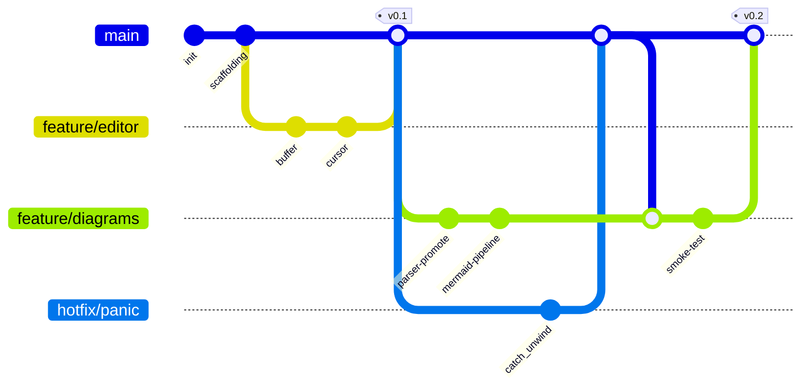
```mermaid
gitGraph
    commit id: "init"
    commit id: "scaffolding"
    branch feature/editor
    checkout feature/editor
    commit id: "buffer"
    commit id: "cursor"
    checkout main
    merge feature/editor tag: "v0.1"
    branch feature/diagrams
    checkout feature/diagrams
    commit id: "parser-promote"
    commit id: "mermaid-pipeline"
    checkout main
    branch hotfix/panic
    commit id: "catch_unwind"
    checkout main
    merge hotfix/panic
    checkout feature/diagrams
    merge main
    commit id: "smoke-test"
    checkout main
    merge feature/diagrams tag: "v0.2"
```

### ZenUML

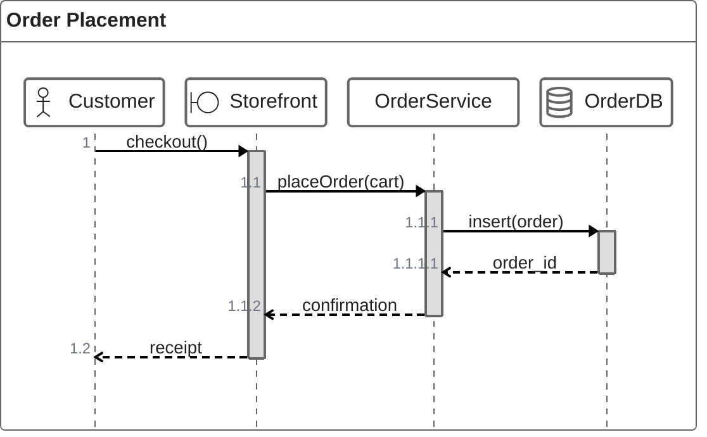
```mermaid
zenuml
    title Order Placement
    @Actor Customer
    @Boundary Storefront
    @EC OrderService
    @Database OrderDB

    Customer->Storefront.checkout() {
        Storefront->OrderService.placeOrder(cart) {
            OrderService->OrderDB.insert(order) {
                return order_id
            }
            return confirmation
        }
        return receipt
    }
```

### Packet

```mermaid
packet-beta
    title TCP Header
    0-15: "Source Port"
    16-31: "Destination Port"
    32-63: "Sequence Number"
    64-95: "Acknowledgment Number"
    96-99: "Data Offset"
    100-105: "Reserved"
    106: "URG"
    107: "ACK"
    108: "PSH"
    109: "RST"
    110: "SYN"
    111: "FIN"
    112-127: "Window"
    128-143: "Checksum"
    144-159: "Urgent Pointer"
    160-191: "(Options and Padding)"
    192-223: "Data (variable length)"
```

### Radar

```mermaid
radar-beta
    title Engineer skill matrix
    axis r["Rust"], j["JavaScript"], p["Python"], s["SQL"], d["DevOps"], x["Design"]
    curve a["Alice"]{85, 60, 70, 80, 55, 40}
    curve b["Bob"]{55, 90, 80, 70, 65, 75}
    curve c["Carol"]{70, 70, 60, 85, 90, 50}

    max 100
    min 0
```

### Treemap

```mermaid
treemap-beta
"Backend"
    "API":          42
    "Workers":      18
    "Database":
        "Schema":   8
        "Migrations": 4
"Frontend"
    "Web":          30
    "Mobile":       12
"Infra"
    "CI/CD":        6
    "Monitoring":   9
    "Deploy":       5
```
