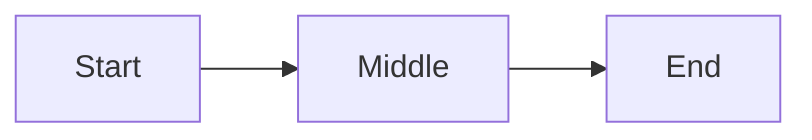

# Row provenance smoke test

Open this in Rendered mode with the gutter on. Check every section at about 80 columns and again at 12–30 columns, with `reflow_paragraphs` on and off, and once with big H1 on.

The same two checks apply everywhere. **Cursor:** move through every line; the revealed row is the cursor's own source line and the gutter number matches it. **Click:** click characters; the cursor lands on the char under the pointer, and clicking where the cursor shows keeps it there. Each section's note lists what is specific to it.

Several paragraphs below are deliberately broken across source lines: that is what reflow joins and what the reveal stacks.

The frontmatter above is verbatim: moving into it never de-renders its rows.

## 1. Blockquotes

Each bare `>` line renders exactly one quoted blank row, and the quote invents none the source lacks. The loose list keeps its spacing.

> first child
>
>
> second child, after two bare lines
>
> - loose a
>
> - loose b
>
> tail after the loose list

An empty quote still renders its row:

>

A link reference definition inside a quote renders nothing, so the quote below starts with its prose:

> [quoted]: https://example.com/quoted
> The first line of this quote is a definition; here is [the reference][quoted].

A quoted paragraph across source lines. Reflow on joins it into one row; entering it stacks the whole source lines, `>` included, and keeps the quote's wash:

> alpha bravo charlie
> delta *echo foxtrot
> golf* hotel india
> juliet kilo lima

A lazy continuation:

> quoted alpha
lazy line belonging to the quote

Width-sized blocks inside quotes end at the window edge without wrapping (#67), one and two levels deep. The `> ---` is a rule, not a second frontmatter block:

> | alpha beta gamma | delta epsilon zeta eta |
> |---|---|
> | one two three four | five six seven eight nine |
>
> ---
>
> ```
> code inside a quote
> ```
>
> > | nested | quote |
> > |---|---|
> > | x | y |
> >
> > ***

## 2. Lists

With reflow off, every paragraph here renders one row per source line, the item's first paragraph included. With reflow on, each paragraph joins into one flow, and entering it stacks its source lines with their markers.

- First item's first paragraph,
  written across three source lines,
  so reflow off shows three rows.

  The same item's second paragraph,
  also across two lines.

- The cursor on the blank line above this item, inside the first item, reveals that line in place; it must not stack a paragraph around it.

Moving up from one item's paragraph into another's moves the reveal to the new paragraph; entering a paragraph from below reveals it at once.

- alpha bravo charlie
  delta echo foxtrot
- golf hotel india
  juliet kilo lima
- mike

A marker rendered on a row of its own: the cursor sits on the content row, never on the bare marker row.

- - nested bullet on the marker line
- > quote opening an item
- # Heading opening an item
-
  bare marker, text on the next line

Task boxes and markers: click the box, the marker and the text.

- [ ] open task whose text
  continues on a second line
- [x] done task

Ordered markers of different widths, and a lazy continuation:

1. one
2. two
   continued
10. ten
lazy continuation line

A tight item followed by a block on its next line: the item's text stops where the block starts (#66).

- tight item
  # heading inside the item
- tight item
  ```
  fence opened on the item's next line
  ```
- last

A fence opened on a marker line, then a loose item:

- ```bash
  code on a marker line
  ```
- next item

- third item, loose

An unclosed fence inside an item ends with the item:

- a
  ```
  unclosed
- b

Deep nesting with soft breaks:

- a
  - b
    soft *word* continues
    across lines
    - c
      deep word
      on two lines

after the list

Code nested in an ordered item, with a blank line and extra indent inside it:

8. Tag it.

    ```bash
    git tag v1.0.0
    gh run watch

      indented
    ```

## 3. Headings

Top-level setext H2s, multi-line ones included, get a rule row for their underline. A click on an underline lands on the nearest content column.

Setext H1
=========

Setext H2
---------

Multi-line
setext H2
---

Indented underline
   ---

#tag
---

## ATX with a closing sequence ##

- Nested setext H2 (no rule row, by design)
  ---

## 4. Code and verbatim rows

Code bodies, frontmatter and raw HTML never de-render. Click inside each body: the cursor lands on the clicked char, not shifted by the indent or the pad cell. A click on a fence row lands on the nearest content.

    indented code block
    second line

```rust
fn main() {
	let tab_indented = true;
}
```

<div>raw HTML block</div>

<!-- an HTML comment: a click lands on its opening -->

Horizontal rules: a click lands on the first rule char.

---

***

___

Set the window to exactly 40 columns: the line below fills it, and its end-of-line cursor is drawn over the last char.

Forty cells: resize the window to match.

## 5. Inline mapping and highlights

Select across each line below, search for words in it, and yank it. The highlight covers exactly the selected chars (these lines used to lose their highlight).

Ellipsis... en--dash and em---dash.

A [reference link][two], a collapsed [two][], a shortcut [two], and an undefined [nope] left literal.

A ==highlight== beside an ellipsis..., and x == y... too.

A `code span`, *emphasis*, **strong**, ~~strike~~, an &amp; entity, \*escaped stars\*, and <https://example.com>.

A link whose close [opens
](https://example.com) the next line.

[two]: https://example.com/two

## 6. Footnotes

A click on a footnote leader follows the back-link. The CJK label's continuation aligns under its text, in cells. A long footnote flow reflows; its wrap indent is known to be one cell short (#71).

Footnotes: short[^short], long[^long], CJK[^日本], undefined [^nope] stays literal.

[^short]: A short footnote.

[^long]: A long footnote whose first paragraph
    runs across two source lines.

    Its second paragraph, also
    across two lines.

    | a | b |
    |---|---|
    | 1 | 2 |

[^日本]: a CJK label
    continuation aligns under the text

## 7. Tables

A click on a border lands in the cell beside it; on the heavy header rule, in the first data row. A drag stays in its cell. A nested or quoted table reveals cell by cell.

| Column one | Column two, which is longer |
|------------|-----------------------------|
| alpha      | beta                        |
| gamma      | delta with `code`           |

A header-only table:

| only | header |
|---|---|

A table inside a list item:

- item

  | a | b |
  |---|---|
  | 1 | 2 |

Missing edge pipes: known to fall back to a whole-line reveal and one-for-one columns (#70).

a | b
--|--
1 | 2

## 8. Images and diagrams

Reveal each block and click its rows. A click on the math preview band lands on the formula's first line; a click on padding rows lands on the last line. Yank a revealed line: the flash covers its raw text.




$$
E = mc^2
$$

## 9. Preview mode

Switch to Preview and repeat a few clicks from every section: nothing reveals, a click on the cursor's row maps normally, and the nested table above gets the cell band.
