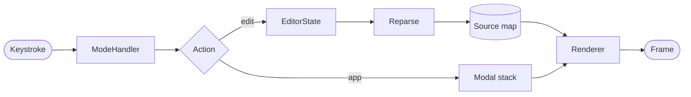

# Field Notes: Editing Markdown in the Terminal

A sample document for **edamame** — it doubles as a smoke test, so it exercises most of the rendering surface while still reading like something you'd actually write.[^1]

> Markdown is the right format for most documents, and it has become the medium we use to work with agents — so we all read and edit a lot more of it than we used to.

---

## The problem

The tools are mostly split. Electron apps render beautifully but feel slow. Text editors are fast but show you asterisks and pipe characters. Plugins can *decorate* a line without being able to *restructure* it, so a table stays a row of `|` characters no matter how it's colored.

edamame renders the document and lets you edit it in place. Only the line under the cursor drops to raw Markdown, and it snaps back the moment you move away.[^2]

### How a keystroke moves through the app



## What it does

1. **Hybrid rendered/raw editing** — the document stays formatted while you type
2. **Real table editing** — a grid you move through cell by cell, not a row of pipes
    1. `Tab` and `Shift-Tab` walk the cells
    2. Dragging a column divider resizes it
    3. Rows and columns can be added or removed in place
3. **Search and replace**, with smartcase navigation
4. **Diff review** for changes made by something else while the file was open

- [x] Inline images and Mermaid diagrams, where the terminal supports them
    - [x] Kitty, iTerm2 and Sixel protocols
    - [ ] Halfblocks everywhere else
- [x] Footnotes, task lists, list continuation and renumbering
- [ ] Collaborative editing — *not planned*
- [ ] A plugin API — see the note on scope in `CONTRIBUTING.md`

## The stack

| Crate | Version | Purpose |
|:---|---:|:---|
| `ratatui` | 0.29 | **TUI framework** — widgets, layout, rendering |
| `crossterm` | 0.29 | Terminal backend, raw mode, event handling |
| `pulldown-cmark` | 0.13 | CommonMark + GFM parsing with source-map offsets |
| `ropey` | 1.6 | Rope data structure for the text buffer |
| `fancy-regex` | 0.17 | Backreferences and lookaround for `:s` substitution |

Small tables size themselves to their content:

| Mode | Chord |
| --- | --- |
| Preview | `Esc` |
| Rendered | any key |
| Raw | ``Ctrl-` `` |

A column can hold escaped pipes, which stay literal:

| Pattern | Matches |
| ------- | ------- |
| `a\|b` | either branch |
| b \| im | a bare escaped pipe |

## A closer look at the code

<!-- The block below is also the fixture for code-block wrapping. -->

#### Block-level render memoization

Rendering is memoized per block, keyed by the AST value rather than the source bytes — `let cached = cache.get(&block, &settings);` is the whole idea, and it is what keeps a live table-column drag from re-rendering the entire document.

```rust
// ── Logging setup ─────────────────────────────────────────────────────────────

/// Initialize the file-based tracing subscriber.
///
/// Returns the non-blocking writer guard; dropping it flushes and closes the
/// log file, so it must be kept alive for the duration of the program.
fn setup_logging() -> Option<tracing_appender::non_blocking::WorkerGuard> {
    let log_dir = Config::log_dir()?;
    std::fs::create_dir_all(&log_dir).ok()?;

    // A deliberately over-long comment, wider than any sensible terminal, so that horizontal overflow inside a fenced block is easy to eyeball.
    let file_appender = tracing_appender::rolling::daily(&log_dir, "debug.log");
    let (non_blocking, guard) = tracing_appender::non_blocking(file_appender);

    tracing_subscriber::fmt()
        .with_writer(non_blocking)
        .with_ansi(false)
        .init();

    tracing::info!("edamame starting");
    Some(guard)
}
```

Inline code inside a long paragraph wraps with the rest of the text: ` let (non_blocking, guard) = tracing_appender::non_blocking(file_appender); ` sits mid-sentence without breaking the line-fill.

## Typography

**Bold text** and __underscore bold__, *italic* and _underscore italic_, ***both at once***, ~~struck through~~, and ==highlighted==.

A [web link](https://github.com/mijowi/edamame), a [file link](./sample_diagrams.md), and a [link to a heading](#the-stack) further up this document.

Escapes stay verbatim: \*not emphasized*, \# not a heading, \`not code`,
1\. not a list, and \&ouml; not a character entity.

## Images

Local files render inline where the terminal supports an image protocol:


So do remote ones, after you approve the fetch:


Loose lists
-----------

+ A list item long enough to wrap on any reasonable terminal width, which is what makes it useful for checking that continuation lines line up under the text rather than under the marker.

+ Separated from its neighbors by blank lines, which makes the list *loose*

+ Numbering and spacing both come straight from the parser

## Closing

You miss 100% of the shots you don't take.[^3][^4]

***

[^1]: The rest of the rationale lives in `docs/dev/why.md`.
[^2]: The reveal is delayed by 120 ms so that holding an arrow key doesn't strobe the document.
[^3]: Attributed to Wayne Gretzky.
[^4]: Attributed to Michael Scott.
